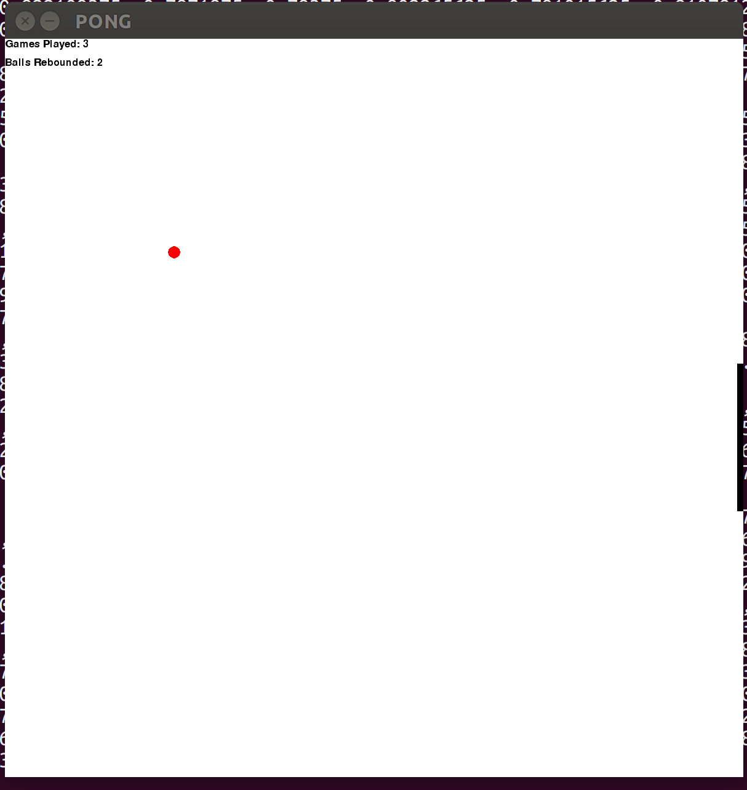
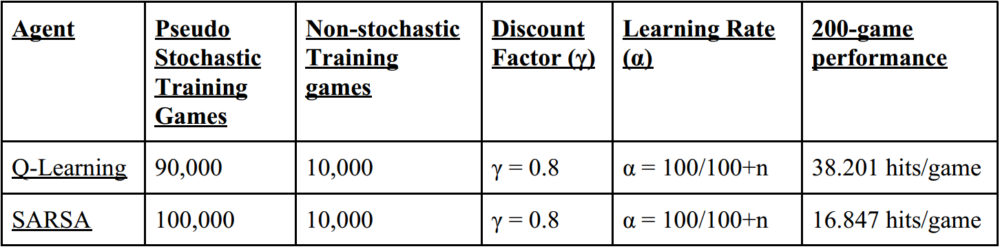
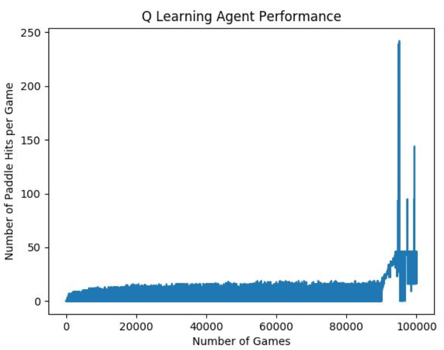
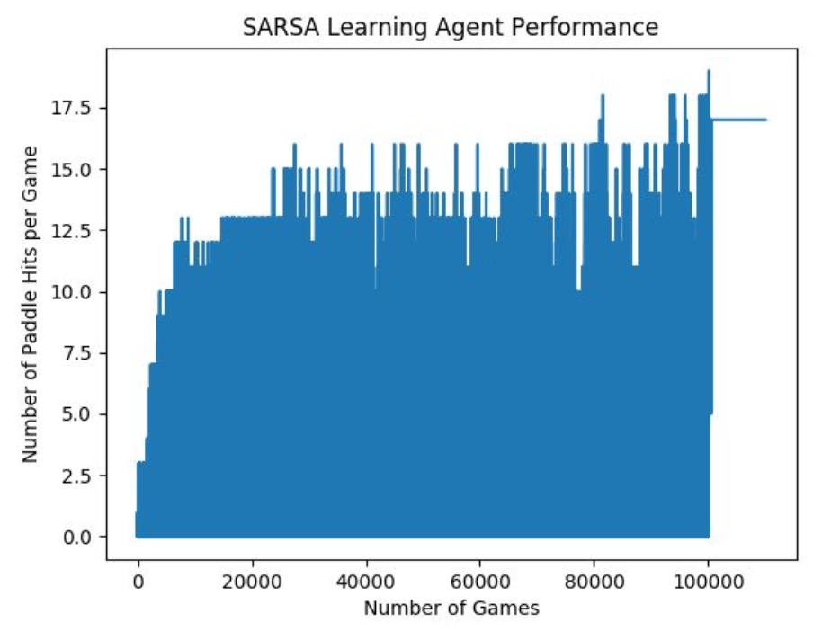
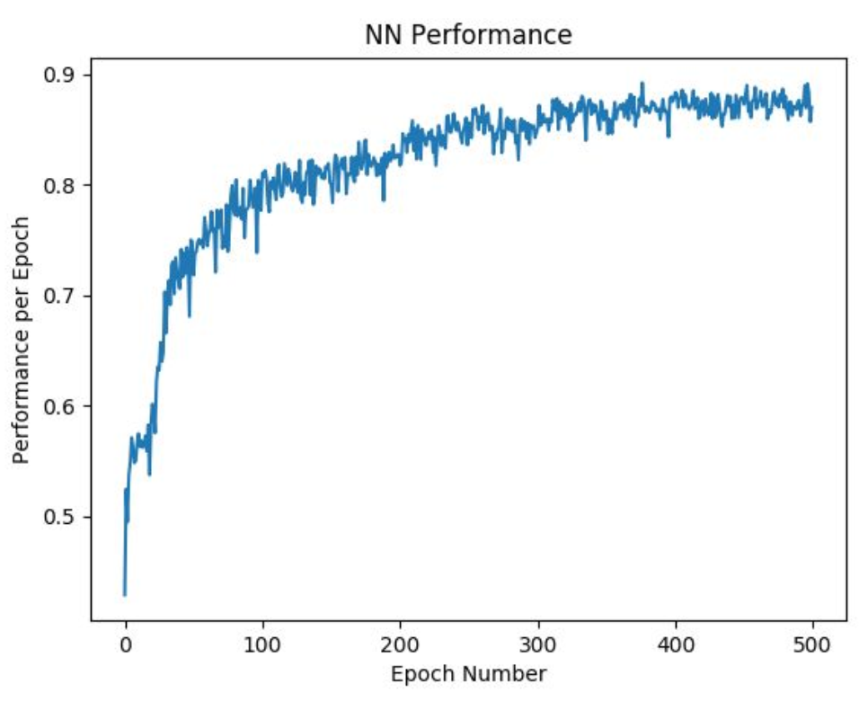
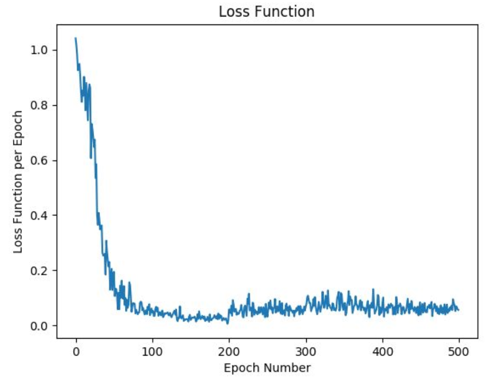

# Q Learning vs SARSA Agent

Our exploration function utilized both pseudo-stochastic and non-stochastic games in the training
phase. Here, we consider ‘pseudo-stochastic’ games to be games with ε = 0.3 in the exploration
function, 30% of prospective actions are random, and ‘non-stochastic’ games have ε = 0, where
0% of prospective actions are random.
For our Q-Learning agent, we used 90,000 pseudo-stochastic games to make sure that a certain
percentage of moves were dedicated to exploring a new state. Then, we train on 10,000
non-stochastic games to reinforce the agent’s on-policy behavior. For our SARSA agent, we had
a similar exploration function but instead of 90,000 pseudo-stochastic games, we trained on
100,000 pseudo-stochastic games. Both agents had the same discount factor, γ = 0.8, and
learning rate, α = (100/(100+n)), where n is the number of occurrences of any given state.
Our choices and results are also indicated in the table below:

## Mean Episode Reward vs. Episode

Our Q-Learning agent improved significantly from the 2-phase training model that we employed,
as we can see a marked improvement over games 90,000 through 100,000, where ε = 0. Our
Q-Learning agent also outperformed its own trend at times, visible in the high peaks in the
non-stochastic training segment. We tuned the breakdown of 100,000 games between
pseudo-stochastic and non-stochastic games for the Q-learning agent to maximize hits/game, and
arrived at the 90/10 split. For the SARSA agent, we observed a lot more variance in the
performance of the model even up to the point of 100,000 games. This can be attributed to the
pseudo-stochastic actions taken 30% of the time in the first 100,000 games, and the smooth
performance between 100,000 and 110,000 games can be attributed to the removal of ε.

# Behavioral Cloning and Deep Learning

## Cost-Benefit Analysis: Deep Network vs. Q-Table
A deep learning policy is much more memory efficient because, unlike Q-Learning, it doesn’t
store an entire lookup table of possible game states and maps each respective action. Deep
learning also has the advantage when a game state that hasn’t been previously explored is
reached. In this scenario, Q-Learning will (most likely) not act ideally because the agent has not
learned what action it should perform in this new state. However, a deep learning agent will be
able to make an educated guess based on similar states “nearby” making it an overall more
effective policy than Q-Learning.

## Implementation of Functions and Network Architecture
Our deep neural network was implemented using a 3-layer network with fully-connected layers.
We input 5 logits to the first layer of the network, with 128 neurons, feeding to the second layer
of the network, with 256 neurons, feeding to the output layer of the network, with 3 neurons. Our
affine-forward and affine-backward functions implement the desired output with the NumPy
MatMul matrix multiplication tool. The ReLU and cross-entropy functions are implemented
iteratively. We utilize NumPy arrays for all weights, biases, and intermediate signals of the
network to be able to utilize efficient NumPy tools.

## Deep Learning Accuracy

## Deep Learning Loss Function

